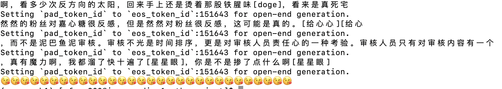

# 乐子人(troll)😆-align

Hey! Welcome to our fun projects of trying to aligning models to trolling values so that models understand the way trolls react, speak, and attack other people! 😅😄😆

## Updates

- **[6/7/2024] created repo, push sample SFT dataset, sample SFT and inference code**
- **[6/18/2024] push sample preference dataset, update interacting interface link, and dpo code**

## What’s This All About?

so in this project we use a crawler and download shit tons of trolling comments from bilibili, and use them as our SFT dataset. We use this dataset to perform SFT on our base model Qwen2-0.5b (as a start, we are also tring to play with Qwen2 of different size). We want to create our preference data, and through that we will hopefully go through the whole aligning process to come up with the final model. 

## How do I play with it?

The first temp model will be pushed to huggingface hub (after i finish writing this awesome README) but im not going to share it here. I should be able to come up with a html page where we can interact with the model soon, and it's link should be here: [Link](https://lindseyfeng.github.io/vtb/asuka_main.html) (for now, this link  takes you to a half finished site that allows you to interact with Qwen2-0.5b through huggingface API, and most of the time this call will be timedout because the huggingface api is experiencing timed out itself. To verify this you can try playing with Qwen2-0.5b through huggingface model card: [Link](https://huggingface.co/Qwen/Qwen2-0.5B?text=sds), and you will very likely (by that i mean 100%)encounter timedout error)

## Sample output

If you are intrigued already, good for you! Here are some fun generation (from a very preliminary SFT model) for you to enjoy: 

## If you want to read my crappy code

`finetuning.py` contains a basic SFT code that you can find anywhere on the internet, while `inference.py` plays with the model trained by `fintuning.py`. `train_set.csv` and `test_set.csv` contains a part of the training set and testing set that we are using right now. 